# Diagramas de Arquitectura - CiberSegura

## 1. Diagrama de Arquitectura General

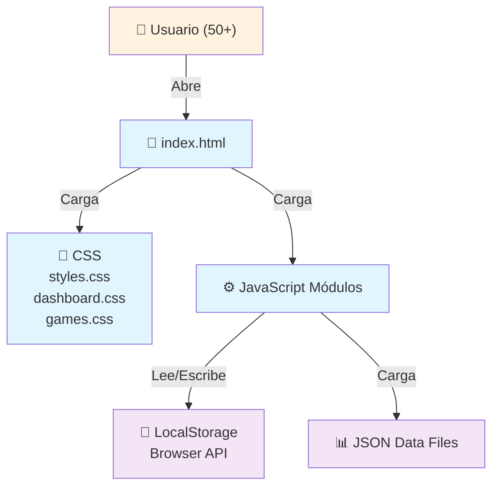

---

## 2. Arquitectura de Módulos JavaScript

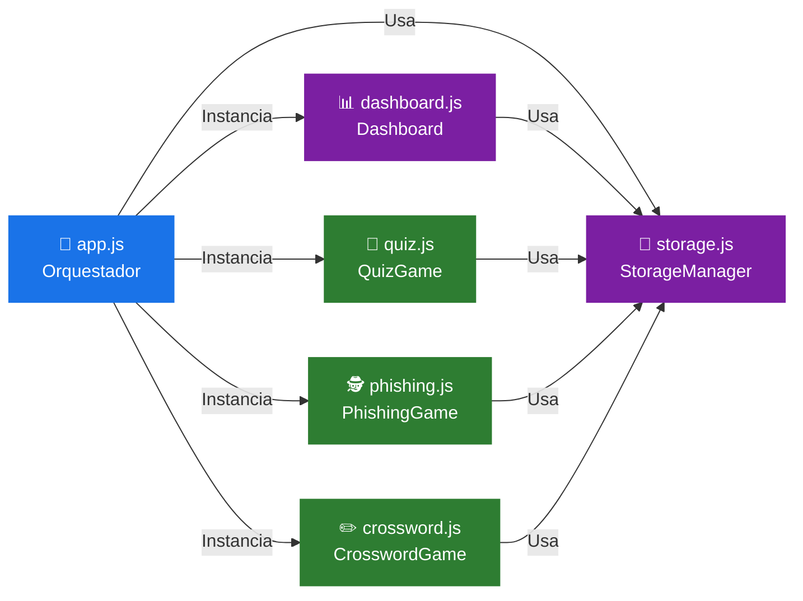

---

## 3. Flujo de Ciclo de Vida de una Actividad

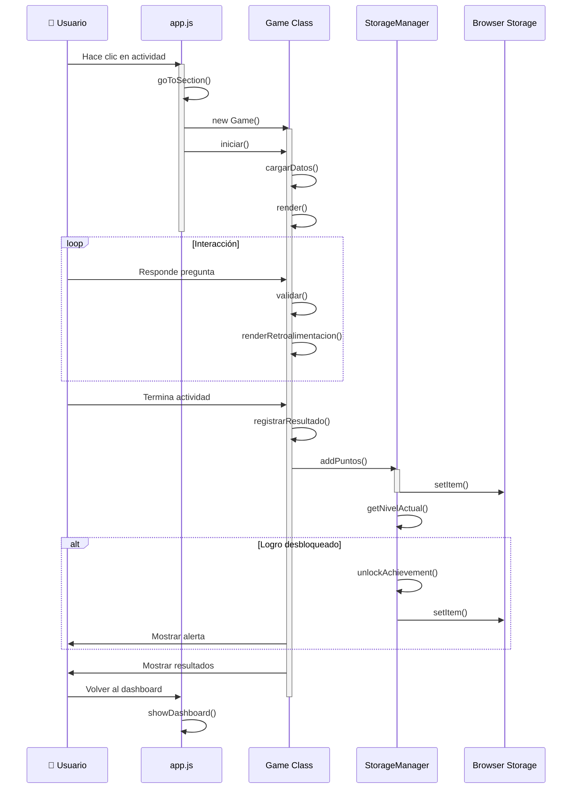

---

## 4. Estado Global del Usuario

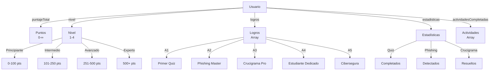

---

## 5. Diagrama de Flujo - Quiz

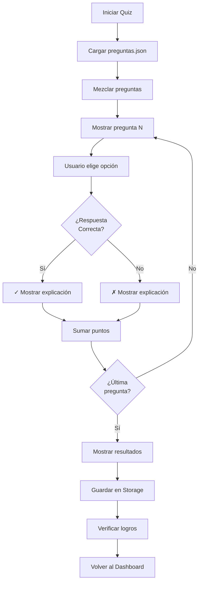

---

## 6. Diagrama de Flujo - Phishing Detector

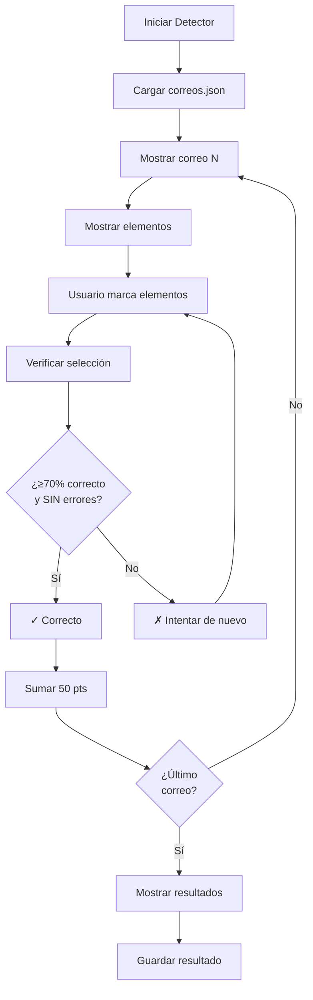

---

## 7. Diagrama de Flujo - Crucigrama

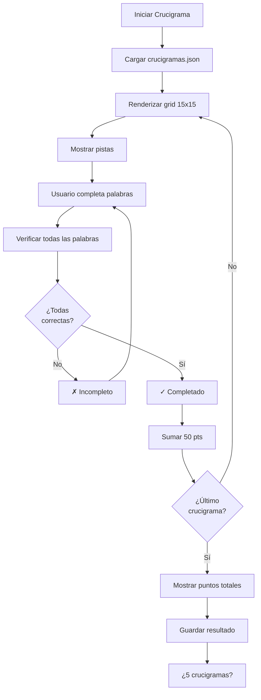

---

## 8. Estructura de Datos LocalStorage

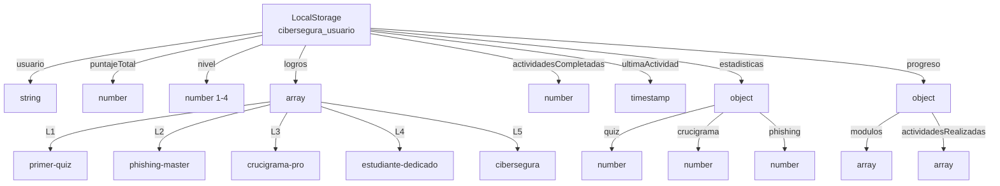

---

## 9. Responsividad - Diseño Adaptativo

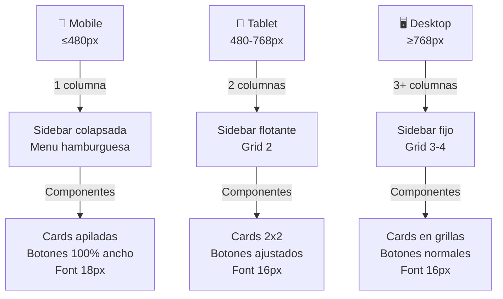

---

## 10. Ciclo de Desbloqueo de Logros

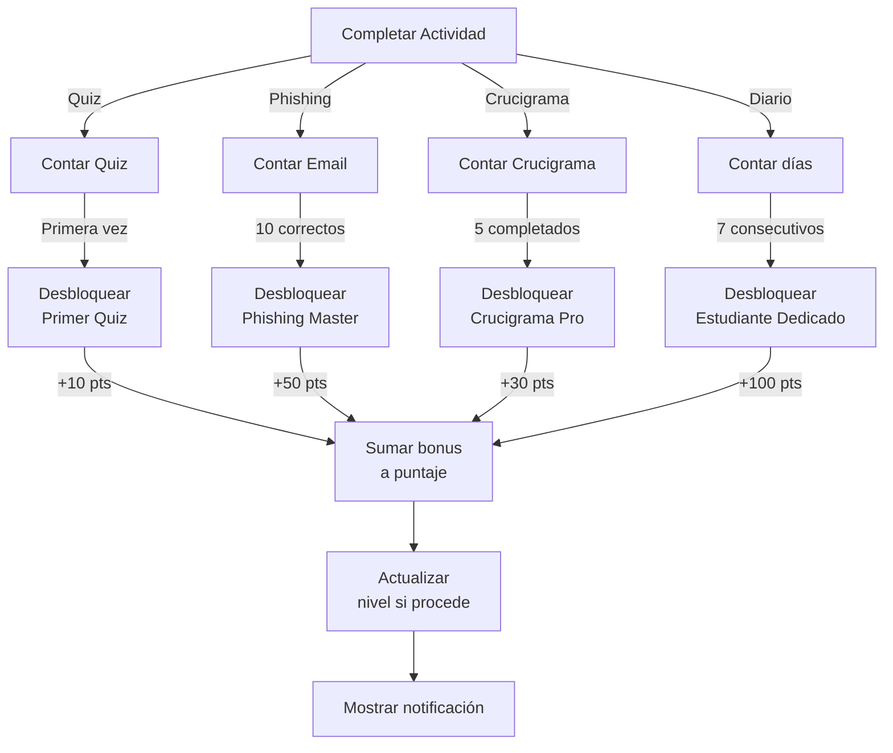

---

## 11. Stack Tecnológico

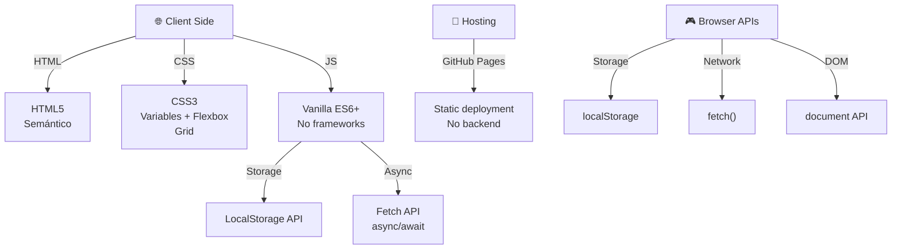

---

**Última actualización**: 2026-06-23
**Versión**: 1.0.0
